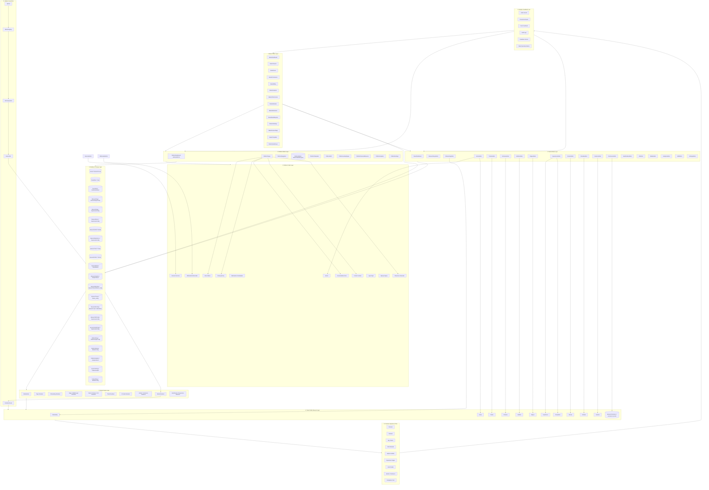

# SCAVerse Architecture Standardization — Canonical Reference Blueprint

This document is the canonical SCAVerse architecture reference after standardization. It preserves the existing platform complexity while making the system easier to maintain, explain, scale, and extend.

## Core Rule

Every customer-facing/public page has an admin mirror page, database/storage source of truth, deterministic render-engine dependency, and enforced ownership boundary.

**Public Page → Admin Mirror → Database / Storage → Isolation Contract → Render Engine → Live Experience → Analytics Feedback Loop**

## Isolation Foundation

Isolation is the first execution priority. Platform records, museum records, media registries, tickets, analytics, walkthroughs, branding, and publish controls must remain separated by ownership scope and tenant identity.

The canonical implementation lives in `lib/isolation-contract.js`, with route-aware tenant context in `lib/tenant-state.js` and permission enforcement through `lib/access-control.js`.

## 1. Mermaid Diagram Format

## 2. Hierarchical Tree Structure

SCAVerse
├── 1. Master Admin Layer
│   ├── MasterDashboard — `/admin/master`
│   ├── MasterTenants — `/admin/master/tenants`
│   ├── MasterUsers — `/admin/master/users`
│   ├── MasterPermissions — `/admin/master/permissions`
│   ├── MasterBilling — `/admin/master/billing`
│   ├── MasterAnalytics — `/admin/master/analytics`
│   ├── MasterInfrastructure — `/admin/master/infrastructure`
│   ├── MasterModules — `/admin/master/modules`
│   ├── MasterModeration — `/admin/master/moderation`
│   ├── MasterMediaRegistry — `/admin/master/media`
│   ├── MasterAISettings — `/admin/master/ai`
│   ├── MasterFeatureFlags — `/admin/master/feature-flags`
│   ├── MasterTemplates — `/admin/master/templates`
│   └── MasterSystemLogs — `/admin/master/logs`
├── 2. Platform Public Layer
│   ├── Home ↔ HomeAdmin
│   ├── About ↔ AboutAdmin
│   ├── Pricing ↔ PricingAdmin
│   ├── Services ↔ ServicesAdmin
│   ├── Marketplace ↔ MarketplaceAdmin
│   ├── WhiteLabel ↔ WhiteLabelAdmin
│   ├── Documentation ↔ DocumentationAdmin
│   ├── Contact ↔ ContactAdmin
│   ├── Login ↔ AuthAdmin
│   ├── Signup ↔ AuthAdmin
│   └── Showcase ↔ ShowcaseAdmin
├── 3. Platform Admin Layer
│   ├── PlatformDashboard — `/admin/platform`
│   ├── PlatformPages — `/admin/platform/pages`
│   ├── PlatformNavigation — `/admin/platform/navigation`
│   ├── PlatformMedia — `/admin/platform/media`
│   ├── PlatformTemplates — `/admin/platform/templates`
│   ├── PlatformSEO — `/admin/platform/seo`
│   ├── PlatformLandingPages — `/admin/platform/landing-pages`
│   ├── PlatformFeaturedMuseums — `/admin/platform/featured-museums`
│   ├── PlatformAnalytics — `/admin/platform/analytics`
│   └── PlatformSettings — `/admin/platform/settings`
├── 4. Tenant Admin Layer
│   ├── TenantDashboard — `/admin/tenant/:tenantId`
│   ├── MuseumSetupAdmin — `/admin/tenant/:tenantId/setup`
│   ├── OnboardingAdmin — `/admin/tenant/:tenantId/onboarding`
│   ├── HomeAdmin — `/admin/tenant/:tenantId/home`
│   ├── TicketsAdmin — `/admin/tenant/:tenantId/tickets`
│   ├── EntranceAdmin — `/admin/tenant/:tenantId/entrance`
│   ├── ExhibitsAdmin — `/admin/tenant/:tenantId/exhibits`
│   ├── StagesAdmin — `/admin/tenant/:tenantId/stages`
│   ├── ExperienceAdmin — `/admin/tenant/:tenantId/experience`
│   ├── RoomsAdmin — `/admin/tenant/:tenantId/rooms`
│   ├── AIGuideAdmin — `/admin/tenant/:tenantId/ai-guide`
│   ├── VendorsAdmin — `/admin/tenant/:tenantId/vendors`
│   ├── CommerceAdmin — `/admin/tenant/:tenantId/commerce`
│   ├── GamificationAdmin — `/admin/tenant/:tenantId/gamification`
│   ├── VRAdmin — `/admin/tenant/:tenantId/vr`
│   ├── MediaAdmin — `/admin/tenant/:tenantId/media`
│   ├── AnalyticsAdmin — `/admin/tenant/:tenantId/analytics`
│   ├── StaffAdmin — `/admin/tenant/:tenantId/staff`
│   └── SettingsAdmin — `/admin/tenant/:tenantId/settings`
├── 5. Tenant Public Museum Layer
│   ├── Onboarding ↔ OnboardingAdmin
│   ├── Home ↔ HomeAdmin
│   ├── Tickets ↔ TicketsAdmin
│   ├── Entrance ↔ EntranceAdmin
│   ├── Exhibits ↔ ExhibitsAdmin
│   ├── Stages ↔ StagesAdmin
│   ├── Experience ↔ ExperienceAdmin
│   ├── Rooms ↔ RoomsAdmin
│   ├── AIGuide ↔ AIGuideAdmin
│   ├── Vendors ↔ VendorsAdmin
│   ├── Commerce ↔ CommerceAdmin
│   └── Completion ↔ ExperienceAdmin
├── 6. Database / Storage Layer
│   ├── Tenant / MuseumTenant
│   ├── TenantUser / User
│   ├── TenantRole / PermissionGrant
│   ├── Museum / MuseumTenant
│   ├── MuseumPage / MuseumPageConfig
│   ├── MuseumStage / ExperienceConfig
│   ├── MuseumRoom / ExperienceConfig
│   ├── MuseumExhibit / Exhibit
│   ├── MuseumExperience / ExperienceConfig
│   ├── MuseumTicket / Ticket
│   ├── MuseumVendor / Vendor
│   ├── MuseumCommerce / commerce records
│   ├── MuseumMedia / TenantMedia
│   ├── MuseumAnalytics / AnalyticsEvent
│   ├── MuseumBranding / MuseumTenant.theme_config
│   ├── MuseumTheme / MuseumTenant.theme_config
│   ├── MuseumAIConfig / MasterPrompt + AIWorkflow + AIOutput
│   ├── MuseumVRConfig / ExperienceConfig
│   ├── MuseumGamification / ExperienceConfig
│   ├── PlatformPage / PlatformPageConfig
│   ├── PlatformModule / ModuleConfig
│   ├── PlatformMedia / PlatformMediaRegistry
│   ├── PlatformAnalytics / AnalyticsEvent
│   ├── SystemSettings / PlatformHealth
│   └── FeatureFlags / ModuleConfig
├── 7. Render Engine Layer
│   ├── ModuleGate
│   ├── PageRenderer
│   ├── OnboardingRenderer
│   ├── StageRenderer
│   ├── RoomRenderer
│   ├── TicketRenderer
│   ├── AIRenderer
│   ├── CommerceRenderer
│   ├── MediaRenderer
│   └── ProgressionRenderer
├── 8. Analytics Layer
│   ├── Visitor events
│   ├── Conversion events
│   ├── Tester feedback
│   ├── Audit logs
│   ├── Readiness scoring
│   └── Slack operational alerts
├── 9. Media / Asset Flow
│   └── Upload → Registry → Assignment → Stored URL → Renderer → Public Asset
└── 10. Customer Experience Flow
    └── Discover → Onboard → Buy Tickets → Enter → Explore → Experience → Ask AI → Shop → Complete

## 3. System Flow Format

Master Admin → Platform Admin → Tenant Admin → Database / Storage → Render Engine → Tenant Public Museum → Customer Experience → Analytics Feedback Loop → Admin Layers.

Media / Asset Flow: Upload → Media Registry → Slot Assignment → Stored URL → Render Engine → Public Experience.

AI Flow: Master AI Settings → Tenant AI Guide Config → AI Prompt/Workflow Records → AI Guide Renderer → Customer AI Interaction → Analytics / Moderation Feedback.

VR / Gamification Flow: Tenant Experience Config → Rooms / Stages / Progression Config → Render Engine → VR-ready / Gamified Public Experience → Analytics Feedback.

Ticketing Flow: TicketsAdmin → Ticket Records / Module Config → Ticket Renderer → Customer Booking → Analytics Feedback.

Onboarding Flow: OnboardingAdmin → ExperienceConfig / MuseumPageConfig → Onboarding Renderer → Customer Journey Start → Progress Analytics.

## 4. Route Structure Format

### Platform Public
- `/`
- `/about`
- `/pricing`
- `/services`
- `/marketplace`
- `/docs`
- `/contact`
- `/login`
- `/signup`
- `/showcase`
- `/white-label`

### Platform Admin
- `/admin/platform`
- `/admin/platform/pages`
- `/admin/platform/media`
- `/admin/platform/analytics`
- `/admin/platform/navigation`
- `/admin/platform/templates`
- `/admin/platform/seo`
- `/admin/platform/landing-pages`
- `/admin/platform/featured-museums`
- `/admin/platform/settings`

### Master Admin
- `/admin/master`
- `/admin/master/tenants`
- `/admin/master/users`
- `/admin/master/system`
- `/admin/master/permissions`
- `/admin/master/billing`
- `/admin/master/analytics`
- `/admin/master/infrastructure`
- `/admin/master/modules`
- `/admin/master/moderation`
- `/admin/master/media`
- `/admin/master/ai`
- `/admin/master/feature-flags`
- `/admin/master/templates`
- `/admin/master/logs`

### Tenant Admin
- `/admin/tenant/:tenantId`
- `/admin/tenant/:tenantId/setup`
- `/admin/tenant/:tenantId/onboarding`
- `/admin/tenant/:tenantId/home`
- `/admin/tenant/:tenantId/tickets`
- `/admin/tenant/:tenantId/entrance`
- `/admin/tenant/:tenantId/exhibits`
- `/admin/tenant/:tenantId/stages`
- `/admin/tenant/:tenantId/experience`
- `/admin/tenant/:tenantId/rooms`
- `/admin/tenant/:tenantId/ai-guide`
- `/admin/tenant/:tenantId/vendors`
- `/admin/tenant/:tenantId/commerce`
- `/admin/tenant/:tenantId/gamification`
- `/admin/tenant/:tenantId/vr`
- `/admin/tenant/:tenantId/media`
- `/admin/tenant/:tenantId/analytics`
- `/admin/tenant/:tenantId/staff`
- `/admin/tenant/:tenantId/settings`

### Tenant Public
- `/museum/:tenantSlug`
- `/museum/:tenantSlug/onboarding`
- `/museum/:tenantSlug/home`
- `/museum/:tenantSlug/tickets`
- `/museum/:tenantSlug/entrance`
- `/museum/:tenantSlug/exhibits`
- `/museum/:tenantSlug/stages`
- `/museum/:tenantSlug/experience`
- `/museum/:tenantSlug/rooms`
- `/museum/:tenantSlug/guide`
- `/museum/:tenantSlug/ai-guide`
- `/museum/:tenantSlug/vendors`
- `/museum/:tenantSlug/commerce`
- `/museum/:tenantSlug/completion`

## 5. Final Validation

- No existing architecture was deleted.
- No routes were removed; canonical aliases were added safely.
- No entities were deleted; schemas were expanded non-destructively.
- Tenant isolation remains tenantSlug / tenantId / ownershipScope driven.
- Platform Admin and Master Admin remain separate layers.
- Public/admin mirror relationships are documented for every standardized public page.
- Database-driven rendering is preserved through PlatformPageConfig, MuseumPageConfig, ExperienceConfig, ModuleConfig, media registries, and tenant-scoped entities.
- Media, analytics, AI, VR, gamification, ticketing, onboarding, and customer journey relationships remain connected.
- The architecture remains modular, scalable, dynamic, deterministic, tenant-safe, VR-ready, gamification-ready, AI-ready, and future-proof.